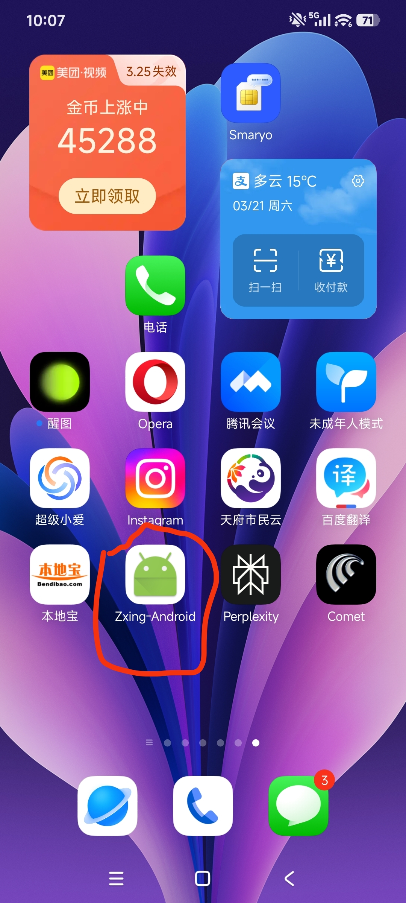
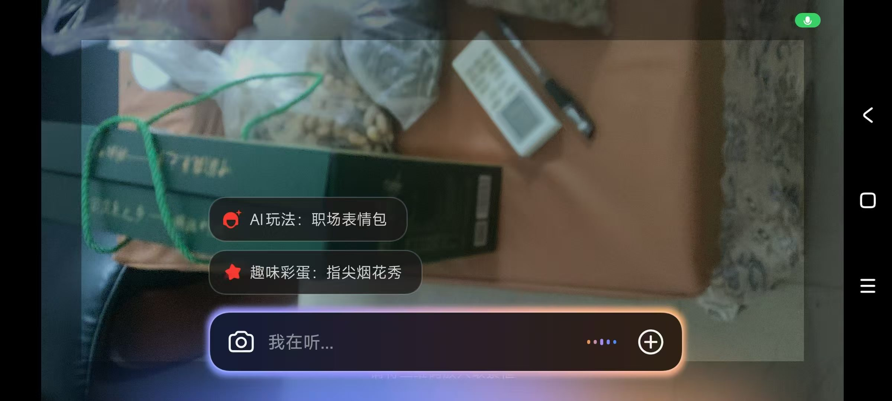
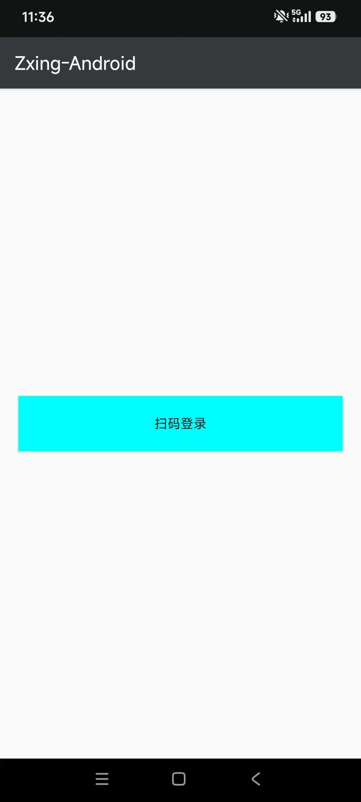
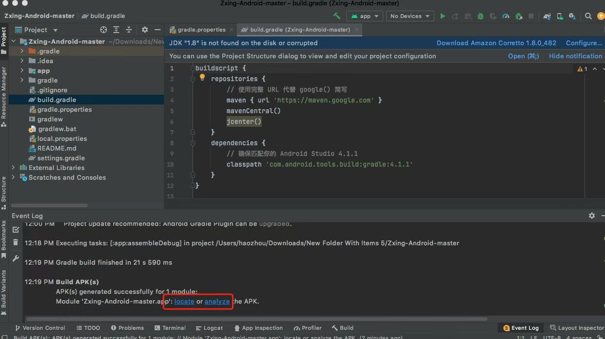

# ZXing Android Embedded (Compilación para macOS 10.15 Catalina)

Esta es una biblioteca de escaneo de códigos de barras para Android, basada en [ZXing][2].

## 🔧 Notas del desarrollador

Este repositorio contiene una versión que modifiqué y compilé con éxito en una **Mac de 2019 (macOS 10.15 Catalina)**.

Dado que el proyecto original podría presentar problemas de incompatibilidad con el entorno de compilación en sistemas y hardware más antiguos, realicé algunos ajustes menores para mi máquina de 2019 (incluida la configuración de Gradle y los ajustes de la versión del SDK) para asegurar su correcto funcionamiento en este entorno. Si también utiliza un dispositivo o sistema antiguo similar, esta versión le resultará muy adecuada.

--

## 📸 Capturas de pantalla de la ejecución y la compilación

### 1. Icono de la aplicación
El icono que se genera en la pantalla de inicio del teléfono Android.

### 2. Integración del menú de funciones Así se ve la función de escaneo de códigos QR integrada en el menú de funciones.

### 3. Interfaz principal de la aplicación Esta es la interfaz principal que se muestra después de hacer clic en "Escanear para iniciar sesión".

### 4. Registro de compilación exitosa de Android Studio Este es el registro después de ejecutar correctamente `assembleDebug` en mi máquina. Aunque hubo advertencias de JDK, el APK se generó correctamente.

---

## Características principales

1. Admite llamadas mediante Intent (código mínimo).

2. Se puede integrar en Activities, lo que permite una interfaz de usuario y una lógica altamente personalizables.

3. Admite escaneo en modo horizontal o vertical.

4. Un hilo en segundo plano gestiona la cámara, lo que resulta en un inicio rápido. ## Cómo compilar en macOS 10.15

1. Usa Android Studio con una versión anterior de Gradle.

2. Ejecuta `./gradlew assembleDebug` para encontrar el APK en la ruta generada.

--- (La siguiente es la descripción original del proyecto)

[2]: https://github.com/zxing/zxing/